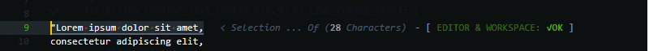
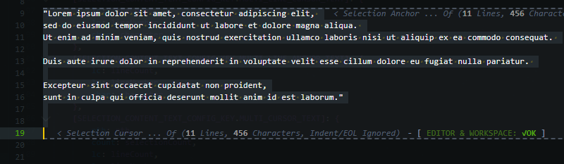
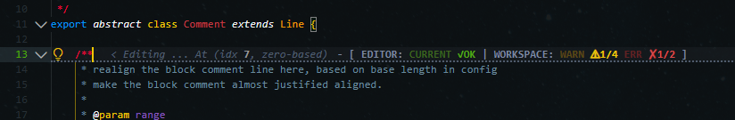
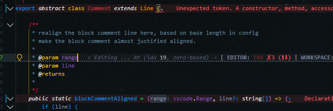
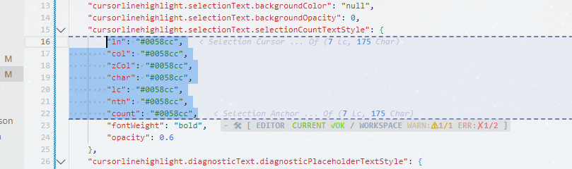
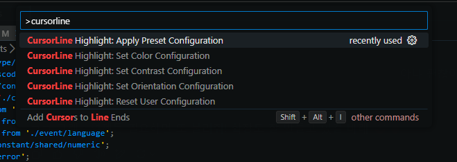
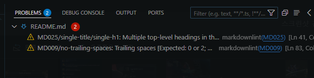
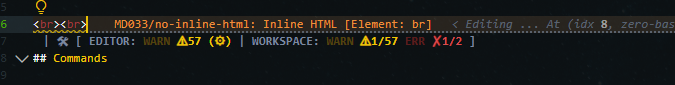

# Introduction

Highly customizable cursor/selection overlay extension. 
This extension displays selection status overlay on real time as you change the cursor/selection position,  which is equivelant of `Editor Selection` in `Status Bar` as well as diagnostic count of editor/workspace in `Problem view`. You can enabled/disabled the features that you only need, if you don't need them all. Here are the examples of this extension with default confuguration as out of the box.

#### <ins>Preview: Cursor Only Highlight</ins>

<br>

> When only a cursor is on an editor. No characters in selection.

#### <ins>Preview: SingleLine Highlight</ins>

<br>

> When selection is a single line.

#### <ins>Preview: MultiLine Highlight</ins>

<br>

> when selection is only 1, and the selection is Multi-Line.

#### <ins>Preview: MultiCursor Highlight</ins>

<br>

> When selection is more than 1; and multi-Cursor editing.

#### <ins>Preview: Diagnostic</ins>

<br>

> Extension will display the diagnostic status of current editor/workspace. You can change visibily, fixtures, position, format or even Text to Glyph/Emoji.

<br>

> Editor diagonotic will point (equal, up or down) where the problem lines are based on current cursor position. <br>

So far, everything in the examples are on default configuration.<br><br>

<br>

> [!TIP] 
>
> Default color scheme for Light themes<br><br>
> This is what default colors will look like If active color theme is Light theme.<br>
> To achieve the same style as in the example, run these following commands in vscode command palette as following.
>
> 1. `CursorLine Highlight: Apply Color Configuration` > `Light`
>
> 2. `CursorLine Highlight: Apply Preset Configuration` > `Detailed`
>
> 3. `CursorLine Highlight: Set Orientation Configuration` > `Vertical`
>
> Left margin will be adjusted by the preset, which you can change them in the `Settings UI` or `settings.json`.

## Configruation Guide


### Commands

> Open command palette `Ctrl + Shift + p`, then search for `Cursorline` to find the list of the commands.

<br>

- __Command >__ _`CursorLine Highlight: Apply Preset Configuration`_
  - `Detailed`
  - `Simle`
  - `No Glpyph - Detailed`
  - `No Glpyph - Simple`
  - `Emoji - Detailed`
  - `Emoji - Simple`

- __Command >__ _`CursorLine Highlight: Set Color Configuration`_
  - `Light` -  For Light Theme Users
  - `Dark` -  For Dark Theme Users

- __Command >__ _`CursorLine Highlight: Set Contrast Configuration`_
  - `Dim`
  - `Bright`

- __Command >__ _`CursorLine Highlight: Set Orientation Configuration`_
  - `Vertical`
  - `Horizonta`

- __Command >__ _`CursorLine Highlight: Reset User Configuration`_
  - Remove global user configurations of this extension form `settings.json`

> [!WARNING] 
> (Light Theme User Only) Command: Set Contrast Configuration<br><br>
> I Would advice not to use this command if you are using `Light Theme` as it overrides some colors/opacity. I recommand directly changing the values from `Setting UI` or `Setting.json`

### On setting UI

`ctrl + shift + p` and search/open Settign UI, then search 'cursorline'<br>
<br>
Most of configraions should be self-explantory, so i will detail the ones that are not so straight-forward.<br>

> [!TIP]
> If there is a problem with your configruation or if you want to revert them to the default, find a Cog button next to configuration section and click 'Reset Setting'.
⚙️ is hidden but it will appear when you click on the section itself. Or, you can open `setting.json` and remove the configurations.

<br>

## Feature Guide


1. Cursor/selection highlight
2. Selection Status
3. Diagnostic Status

### Cursor/selection highlight

As the examples in the introduction, you can apply the borders and background to selection lines.
The confugrations are very clear to understand, the only thing that you need to know is that highlight color values shares
same opacity value from 'General.' You can also use string literal 'null' to disable the color for border and background.

### Selection Status

> [!IMPORTANT] 
> SelectionText.enabled<br><br>
> You can enable/disable this feature. (Default: Enabled).

Most of configurations are quite straight foword and they are well explained in configuration section.

<br>

You will see cpu usage spike when you repeatly/rapidly drag up and down while you are on multi-line selection.
This is becuase the selection change event can be triggered at average rate at 1000 per second even with some overhead.
The event even could reach 0.3ms between the event call. I would like to implement throttling features to reduce the cpu usage only for multi-line selection.
I tried optimise the performace of multi-line selection, and performance has been improved greatly but it still can spike some if the one repeat the active.

Recently, multi-cursor has been updated to have ascending selection index based on line number becauset the selections array is indexed based on selection action sequence.
Selection array had to be sorted based on line number to have top-down index, and code is not very optimised. You could the input responce slows down when you rapid-fire multi-cursor selection action.
This i would like to fix and update soon.

### Diagnostic status

> [!IMPORTANT]
> SelectionText.enabled<br><br>
> You can enable/disable this feature. (Default: Enabled)

Diagnostic status indicate the same entry in probelm view as the screenshot.

<br>

The configurations are some what complicated, due to complexcity of customizability of status block.

It kinda over-extend when selection status is enabled too, especially if you use horizontally split editors.
I would advice to change the position of diagnostics from setting 'Visibilty'

<br>

Setting to next line put diagnostic on the line bellow where the cursor is.

<br>

I would like to kindly advice to read the 📌 pinned description thoroughly and try it youself.
i will try to list the template strucutre briefly.

- All Ok Placeholder ContentText
  - Template Fixture + [body]
    - body: [prefix] + All Ok ContentText + [postfix]
- Problem Placeholder ContentText
  - Template Fixture + [body: Editor + workspace]
    - Editor
      - [prefix] + ok ContentText + [postfix]
      - [prefix] + warning ContentText + [postfix]
      - [prefix] + error ContentText + [postfix]
    - workspace
      - [prefix] + ok ContentText + [postfix]
      - [prefix] + warning ContentText + [postfix]
      - [prefix] + error ContentText + [postfix]

## Backlog

```plain
************************************************************************************************************

|Sticky List| [!]: issues [?]: not decided [~]: planning, on going

- [!] sometimes created decorationTypes does not have ascending decorationTypeID base on sequence, 
      causing malformed statsus block to be displayed. the only fix is to reload the vscode.
      need better method to have correct display order to prevent such an event.
- [!] direct config update on settings.json leaves selection status text. 

- [?] throttling or debouncing for multi-line selection and multi-cursor selection
- [?] backgroundColor configuration or auto appply background color based on border colour. not sure yet.
- [?] maybe applying preset should have some sort of indicator or message popup that configurations are 
      being updated and will reload. 
- [?] probably document state indicator could be useful? not sure

- [~] configuration pattern improvement.
- [~] configuration code clean up.
- [~] implement new status block for tasks in vscode or from terminal.
- [~] to get back to configuration code at some point and clean up.
- [~] mutline highlight/status has high rendering cost. have been constantly optimizing the cost ever 
      since. this will be onging until no longer spikes even with rapid-fire but maybe it is very 
      difficult without debounce. the problem with debounce or throttlign will introduce some delays 
      with input response. im not sure if i will like that instead cripy response as of now.
- [~] implement new diggnostic position (auto-before) just like (auto-inline).

************************************************************************************************************

|1.4.5 Update|

- [+] new configuration nextLine (auto) or previousLine (auto) for diagnotic visiblity has been added.
- [+] new autoLinePositionDatumPoint has been added to serve a base range point to auto inline 
      diagnotic status when next line length exceed datum point.
- [+] performance improvment for multiLine highlight as well as all types of staus selection status. 
      multi-cursor selection status no longer lags nor slowed on render on UI even when rapid-trigger.
      some large performance improvement refactoring has been done for all selection status.
      the refactoring was focused on maximum usage of references and pointer-like handling. 
- [+] new placeholder 'charOnly' has been added for multi-line that ignores indents and carriage returns. 
- [+] dignostic text placement next line will be displayed on same line when the cursor is on the 
      last line of the document
- [+] bug has been fixed for reloading the configuration when diagnotic was enabled/disabled is changed.
- [+] composite range has been fixed as to be handled by multi-cursor correctly.
- [+] fixed a bug where decoration being rendered on both tab column on editor shift tabs. 
- [+] some partial tweaks on multi-line highlight and diagnostic function.

************************************************************************************************************
```

## Lastly

If you use glyph fonts such as powerline or nerdfont, glyphs in those fonts can be used to customize the contentText too. (You will need to change the editor font to the ones with that glyphs)
I may add font family configuration in the future iteration but i can not guarantee when. I hope you like this extenion and find this extenion as small upgrade to QOL of using vscode.

Thank you for reading.

Feel free to open isseus if you find one, or any feedback or comment is more than welcome.


