# Introduction

Highly customizable cursor/selection overlay extension. 
This extension displays selection status overlay on real time as you change the 
cursor/selection position,  which is equivelant of `Editor Selection` in `Status Bar` 
as well as diagnostic count of editor/workspace in `Problem view`. You can enabled/disabled 
the features that you only need, if you don't need them all. Here are the examples of this
 extension with default confuguration as out of the box.

When you change setting, please read the 📌 pinned description thoroughly and try it.

If you want to build this extension from the source code, run `vsce package --no-dependencies --allow-star-activation`.

> [!TIP] 
>
> When there is a problem with overlay layout, try reload the vscode by following command 
> and see if the the problem is resolved on reload 
> 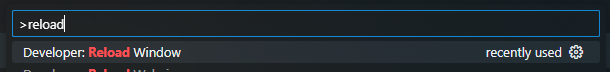 

## Quickstart 

Open command palate and search for `Editor Overlay -> Apply Complete Preset`

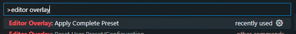 

Then Select Recommanded

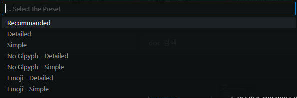 

This is how the recommanded overlay preset

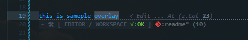 

If you are using light theme, there is a color preset for the light themes

> [!TIP] 
>
> Default color scheme for Light themes  
> 
> 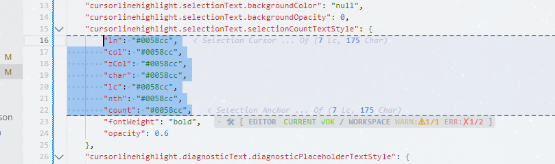 
> 
> To achieve the same style as in the example, run these following commands in vscode command palette as following.
>
> 1. `CursorLine Highlight: Apply Color Configuration` > `Light`
>
> 2. `CursorLine Highlight: Apply Preset Configuration` > `Detailed`
>
> 3. `CursorLine Highlight: Set Orientation Configuration` > `Vertical`
>
> Left margin will be adjusted by the preset, which you can change them in the `Settings UI` or `settings.json`.

#### <ins>Preview: Cursor Only Highlight</ins>

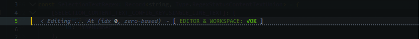 

When only a cursor is on an editor. No characters in selection.

#### <ins>Preview: SingleLine Highlight</ins>

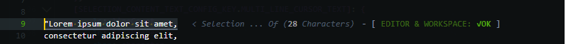 

When selection is a single line.

#### <ins>Preview: MultiLine Highlight</ins>

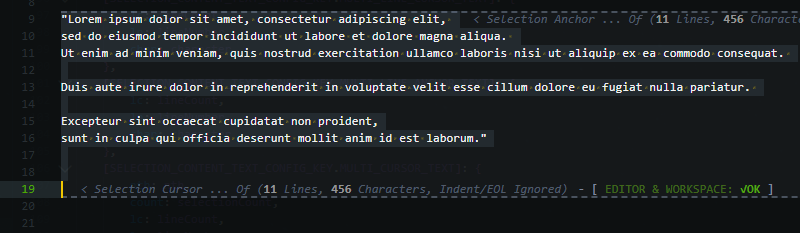 

when selection is only 1, and the selection is Multi-Line.

#### <ins>Preview: MultiCursor Highlight</ins>

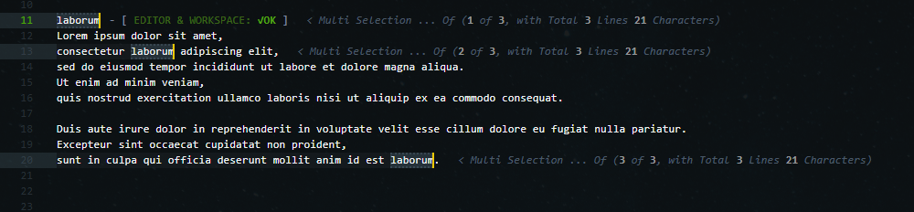 

When selection is more than 1; and multi-Cursor editing.

#### <ins>Preview: Diagnostic</ins>

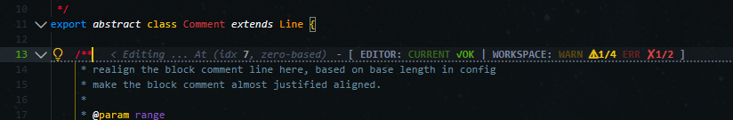 

Extension will display the diagnostic status of current editor/workspace. You can change visibily, fixtures, position, format or even Text to Glyph/Emoji.

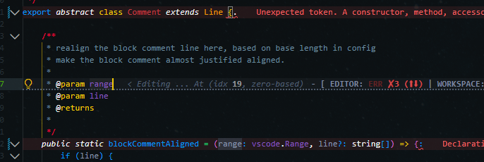 

Editor diagonotic will point (equal, up or down) where the problem lines are based on current cursor position.  

So far, everything in the examples are on default configuration.  

## Configruation Guide

### Commands

> Open command palette `Ctrl + Shift + p`, then search for `Cursorline` to find the list of the commands.

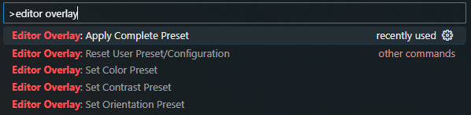 

- __Command__ _`> Editor Overlay: Apply Complete Preset`_
  - `Recommanded`
  - `Detailed`
  - `Simle`
  - `No Glpyph - Detailed`
  - `No Glpyph - Simple`
  - `Emoji - Detailed`
  - `Emoji - Simple`

- __Command__ _`> Editor Overlay: Reset User Preset/Configuration`_
  - Remove global user configurations of this extension form `settings.json`

- __Command__ _`> Editor Overlay: Set Color Preset`_
  - `Light` - For Light Theme Users
  - `Dark` - For Dark Theme Users

- __Command__ _`> Editor Overlay: Set Contrast Preset`_
  - `Dim`
  - `Bright`

- __Command__ _`> Editor Overlay: Set Orientation Preset`_
  - `Vertical`
  - `Horizonta`

> [!WARNING] 
> 
> (Light Theme User Only) Command: Set Contrast Preset  
> I Would advice not to use this command if you are using `Light Theme` as it overrides some colors/opacity. I recommand directly changing the values from `Setting UI` or `Setting.json`

### On setting UI

`ctrl + shift + p` and search/open Settign UI, then search 'cursorline' 
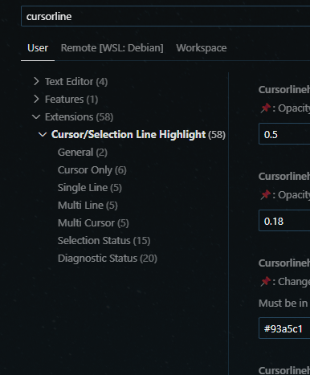 
Most of configraions should be self-explantory, so i will detail the ones that are not so straight-forward. 

> [!TIP]
> If there is a problem with your configruation or if you want to revert them to the default, find a Cog button next to configuration section and click 'Reset Setting'.
⚙️ is hidden but it will appear when you click on the section itself. Or, you can open `setting.json` and remove the configurations.

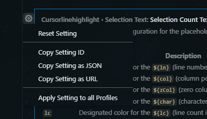 

## Feature Guide

1. Cursor/selection highlight
2. Selection Status
3. Diagnostic Status

### Cursor/selection highlight

As the examples in the introduction, you can apply the borders and background to selection lines.
The confugrations are very clear to understand, the only thing that you need to know is that highlight color values shares
same opacity value from 'General.' You can also use string literal 'null' to disable the color for border and background.

### Selection Status

> [!IMPORTANT] 
> SelectionText.enabled  
> You can enable/disable this feature. (Default: Enabled).

Most of configurations are quite straight foword and they are well explained in configuration section.

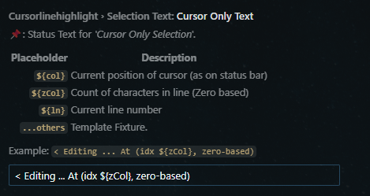 

You will see cpu usage spike when you repeatly/rapidly drag up and down while you are on multi-line selection.
This is becuase the selection change event can be triggered at average rate at 1000 per second even with some overhead.
The event even could reach 0.3ms between the event call. I would like to implement throttling features to reduce the cpu usage only for multi-line selection.
I tried optimise the performace of multi-line selection, and performance has been improved greatly but it still can spike some if the one repeat the active.

Recently, multi-cursor has been updated to have ascending selection index based on line number becauset the selections array is indexed based on selection action sequence.
Selection array had to be sorted based on line number to have top-down index, and code is not very optimised. You could the input responce slows down when you rapid-fire multi-cursor selection action.
This i would like to fix and update soon.

### Diagnostic status

> [!IMPORTANT]
>
> You can enable/disable this feature with SelectionText.enabled (Default: Enabled)

Diagnostic status indicate the same entry in probelm view as the screenshot.

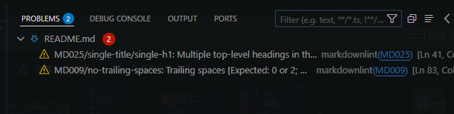 

The configurations are some what complicated, due to complexcity of customizability of status block.

It kinda over-extend when selection status is enabled too, especially if you use horizontally split editors.
I would advice to change the position of diagnostics from setting 'Visibilty'

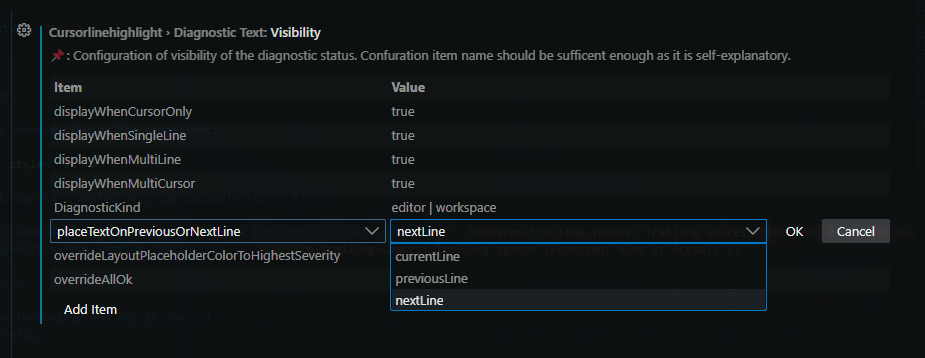 

Setting to next line put diagnostic on the line bellow where the cursor is.

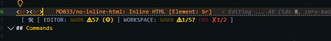 

I would like to kindly advice to read the 📌 pinned description thoroughly and try it youself.
i will try to list the template strucutre briefly.

- All Ok Placeholder ContentText
  - Template Fixture + [body]
    - body: [prefix] + All Ok ContentText + [postfix]
- Problem Placeholder ContentText
  - Template Fixture + [body: Editor + workspace]
    - Editor
      - [prefix] + ok ContentText + [postfix]
      - [prefix] + warning ContentText + [postfix]
      - [prefix] + error ContentText + [postfix]
    - workspace
      - [prefix] + ok ContentText + [postfix]
      - [prefix] + warning ContentText + [postfix]
      - [prefix] + error ContentText + [postfix]

### Git Overlay

Here is the sameple screenshot of the part of the overlay where it starting with git icon.

When checked-out branch has 2 changes and active editor is on git indexed path

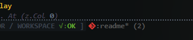 

When checked-out branch is clean and active editor is on git indexed path

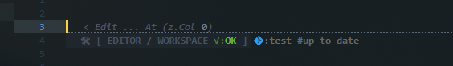 

When checked-out branch has 2 changes but current active editor is on ignored path

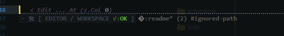 

When change has an index that are in .gitignored.

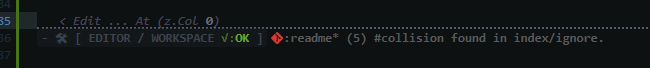 

When active editor is on not-indexed path

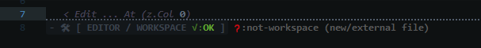 

#### Cross-os-workspace

> [!IMPORTANT] 
> 
> if vscode is running on windows but workspace is in wsl, 
> git overlay will not work unless you change 2 settings from default
> 
> * security.allowedUNCHosts => add wsl remote hostname OR 
> * security.restrictUNCAccess => disabled from enabled
> 
> 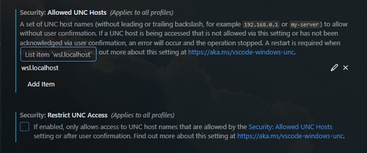 
> 
> this is due to shell to not to have to deal with arbitary string handling 
> and only use cwd to execute commands 
> 

## Lastly

If you use glyph fonts such as powerline or nerdfont, glyphs in those fonts can be used to customize the contentText too. (You will need to change the editor font to the ones with that glyphs)
I may add font family configuration in the future iteration but i can not guarantee when. I hope you like this extenion and find this extenion as small upgrade to QOL of using vscode.

Thank you for reading.

Feel free to open isseus if you find one, or any feedback or comment is more than welcome.
